# System Architecture — Brafitng (Technical Blueprint)

> **Purpose:** This document provides a clear technical overview of Brafitng — a fully virtual, privacy-first bra-fitting web platform. It explains the system stack, component communication, data model, and privacy considerations for the MVP phase.

---

## 1. Overview

Brafitng is a **fully virtual fitting platform** that helps women find bras that are supportive, modest, and comfortable — all from home.  
The system prioritizes privacy, accessibility, and adaptability for:
- Women from **faith backgrounds** emphasizing modesty.
- **Pregnant and breastfeeding women** needing flexible fit support.
- **Women recovering from surgery** or using prosthetics.

The product is **entirely online** — no in-store fittings or physical measurements are required.

---

## 2. High-Level Architecture

Brafitng is built as a **three-tier web application**:

1. **Frontend** – Interactive web app (Next.js + React) for quiz, recommendations, consultations, and fit tracking.  
2. **Backend API** – Node.js service handling business logic, authentication, advisor management, payments, and video session generation.  
3. **Database** – PostgreSQL for secure data storage (user profiles, quiz data, bookings, consultation notes).

Additional integrations:
- **Video/Chat service (Jitsi / Twilio Video)** – for optional virtual consultations.  
- **Payment gateway (Stripe / PayPal)** – for paid consultations or premium services.  
- **Email/SMS service (SendGrid / Twilio)** – for notifications.  
- **Secure storage (AWS S3)** – for encrypted documents or advisor assets (no personal body images stored).

---

## 3. Stack Overview (MVP)

| Layer | Technology | Purpose |
|-------|-------------|----------|
| **Frontend** | Next.js (React), Tailwind CSS | User interface, accessibility, responsive design |
| **Backend** | Node.js (NestJS / Express) | API logic, security, and integrations |
| **Database** | PostgreSQL + Prisma ORM | Persistent data store |
| **Cache / Queues** | Redis (optional) | Session caching, async notifications |
| **Video & Chat** | Jitsi or Twilio | Virtual consultations (audio or video) |
| **Payments** | Paystack / Flutterwave | Paid consultation checkout |
| **Notifications** | SendGrid / Twilio | Email and SMS notifications |
| **Hosting** | Vercel (frontend), AWS / Render / Heroku (backend) | Fast, scalable deployment |
| **CI/CD** | GitHub Actions | Automated testing and deployment |

---

## 4. Component Diagram

## Sequence Diagram — Virtual Consultation Booking

The following sequence diagram illustrates how Brafitng handles a virtual consultation booking, from the user’s action through to confirmation and notifications.

```mermaid
sequenceDiagram
    autonumber
    participant U as 👩‍🦰 User
    participant F as 💻 Frontend (Next.js)
    participant B as 🖥️ Backend (NestJS API)
    participant P as 💳 Payment Gateway (Paystack/Flutterwave)
    participant V as 🎥 Video API (Twilio)
    participant E as ✉️ Email Service (SendGrid)

    U->>F: Takes Fit Quiz (Comfort & Coverage)
    F->>B: POST /quiz/results
    B->>DB: Save QuizResult
    U->>F: Books Virtual Consultation
    F->>B: POST /consultations (preferred advisor + time)
    B->>P: Create payment intent
    P-->>B: Payment confirmation
    B->>V: Generate private consultation link
    V-->>B: Secure session URL
    B->>DB: Save booking + video link
    B-->>F: Return booking confirmation
    B->>E: Send confirmation email & calendar invite
    E-->>U: Email with session details & privacy reminder
```

